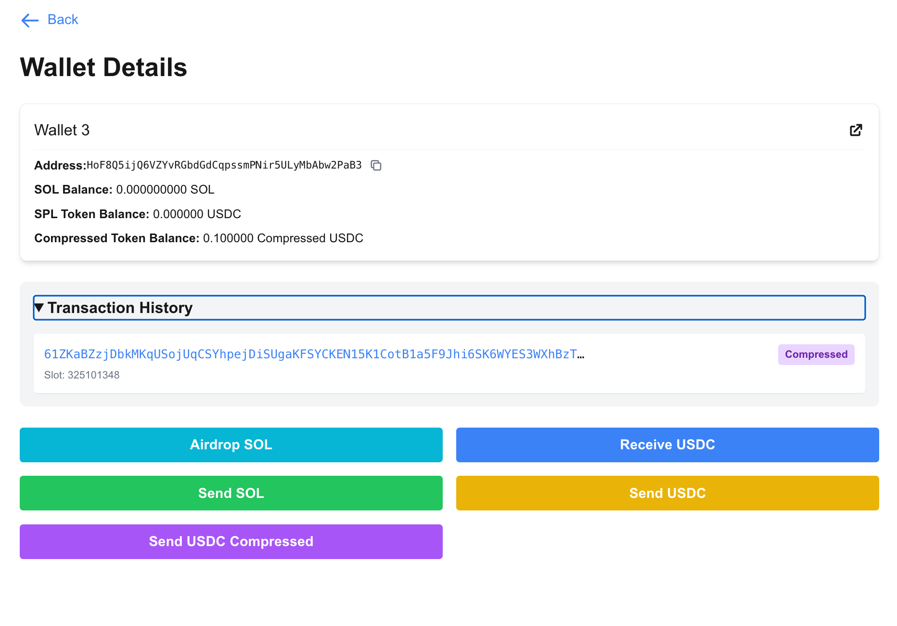

# Solana ZK Compressed Token Wallet

## Overview
The Solana ZK Compressed Token Wallet is a cutting-edge mini-application designed to showcase the power and flexibility of Light Protocol's compressed tokens.
This application allows users to create and interact with Solana wallets on-demand, with a specific focus on zk (zero-knowledge) compressed tokens.
It is designed to only be used on Solana Devnet for demo purposes and is not intended for production use. Private keys are stored in the browser's local storage.
Again: **This is not intended for production use.**

## Screenshot


## Understanding Compressed Tokens
Compressed tokens are an innovative solution in the Solana ecosystem that allows for more efficient storage and management of token data. It specifically addresses the high storage cost associated with token accounts allowing users to avoid this cost almost entirely. While it would normally cost ~0.002 SOL to create an ATA (associated token account) on-chain, with compressed accounts it costs 0.0000053 SOL. That's a reduction of ~400%! Additionally, a brand new account can receive a USDC deposit of a decompressed -> compressed USDC token within [the same transaction](https://photon.helius.dev/tx/4guHP1Qe1Z6i7LNZ5adye9vKXfpV8EBNhHGaeaRae8JHNMdkgwhgMzZY2FdHTWbXcmFgXRskJJo2ivVpkz8U7URL?cluster=mainnet-beta), and then decompresses it as [a withdrawal](https://photon.helius.dev/tx/57ZLpoULfWnQWA8MosS28AdR2udVzhuTkrfMXdbjaWkRipZo3hNENnvRUijCajKiXuEMgPF7aiXwLQDKZMPKVTzv?cluster=mainnet-beta) for a total of 0.0000153 SOL in fees. This allows the end user to completely avoid creating an ATA for this account while still being able to interact with the uncompressed USDC token. Here's a brief overview of how this work:

1. **Data Compression**: Compressed tokens use advanced data compression techniques to reduce the on-chain storage footprint of token accounts.
1. **Zero-Knowledge Proofs**: They leverage zero-knowledge (ZK) technology to maintain a small footprint while ensuring the validity of transactions.
1. **Merkle Trees**: Compressed tokens utilize Merkle trees to store and verify large amounts of data efficiently.
1. **Cost-Effective**: By reducing on-chain storage, compressed tokens significantly lower the cost of creating and managing token accounts.
1. **Scalability**: This technology enables the creation of a much larger number of token accounts without incurring the high storage costs associated with regular token accounts.
1. **Compatibility**: Compressed tokens maintain compatibility with existing Solana infrastructure and can interact seamlessly with regular SPL tokens.

To learn more about compressed tokens and the technology behind them, check out these resources:

- [ZK Compression](https://zkcompression.com/)
- [Helius Blog: ZK Compression](https://www.helius.dev/blog/solana-builders-zk-compression)
- [Light Protocol Documentation](https://docs.lightprotocol.com/)
- [Light Protocol: Compressed Token JS Library](https://github.com/Lightprotocol/light-protocol/tree/main/js/compressed-token)
- [Photon - Helius' Solana ZK Compression Explorer](https://photon.helius.dev/?cluster=mainnet-beta)


## Key Features
1. **Dynamic Wallet Creation**: Generate new Solana wallets instantly within the application. (Does not require connecting a wallet)
1. **Basic Persistence**: Save your wallet addresses locally in the browser's local storage for convenience (Including a user's private keys).
1. **Compressed Account Interaction**: Seamlessly interact with zk compressed accounts.
1. **USDC Transactions**: 
    - Receive USDC to a wallet
    - Send USDC to a compressed account (including your own)
    - Send USDC to a regular Solana wallet
    - send compressed USDC to a regular Solana wallet (including your own)
    - send compressed USDC to a compressed account
1. **Real-time Balance Updates**: View and track wallet balances in real-time (note: updates may take up to 10 seconds to propagate).
1. **Transaction History**: Access a basic history of wallet transactions.
1. **Helius API Integration**: Utilize the Helius API (Photon) to fetch and manage compressed account information.

## Technology Stack
- **Frontend**: Next.js with React
- **Styling**: Tailwind CSS
- **Blockchain Interaction**: Solana Web3.js, Light Protocol Compressed Token JS Library
- **State Management**: React Context API
- **Notifications**: React Toastify

## Architecture
Key components to investigate for your own project:
1. **WalletsStateContext**: Central state management for wallet data.
1. **ApiContext**: Manages API interactions, particularly with Helius.
1. **Wallet Component**: Displays individual wallet information.
1. **WalletHistory Component**: Shows transaction history for each wallet.
1. **WalletActions Component**: Handles wallet operations like sending funds.

## Setup and Installation

1. Clone the repository:
   ```
   git clone https://github.com/gitteri/solana-zk-compression.git
   ```

2. Install dependencies:
   ```
   cd compressed-wallet
   npm install
   ```

3. Set up environment variables:
   Create a `.env.local` file in the root directory and add:
   ```
   NEXT_PUBLIC_HELIUS_API_KEY=your_helius_api_key
   ```
   * Note: you can set desired Solana environment by setting the `NEXT_PUBLIC_NETWORK` environment variable to `devnet` or `mainnet` respectively. If you chose to use mainnet, be sure to use small amounts of funds as the wallets generated are not secure for production use.

4. Run the development server:
   ```
   npm run dev
   ```

5. Open `http://localhost:3000` in your browser.

## Usage Guide

1. **Creating a Wallet**: 
   - Click on the "Create New Wallet" button on the homepage.
   - A new wallet will be generated and added to your list.
   - Note that wallets will be saved to your localstorage for improved UX.

2. **Viewing Wallet Details**:
   - Click on a wallet heading in the list to view its details.
   - You'll see the address, balances, transaction history, and actions you can take.

3. **Sending USDC**:
   - In the wallet details page, use the "Send USDC" or "Send USDC Compressed" form.
   - The "Select Balance to Send" dropdown allows you to choose from existing balances in your wallet (either USDC or compressed USDC).
   - Enter the recipient's address and the amount to send.
       - Note: you can choose from your existing wallets or enter a new one.

4. **Receiving USDC**:
   - In the wallet details page, click the "Receive USDC" button.
   - Copy the address and share it with Circle's USDC faucet to receive USDC.
   - Note: be sure to select Solana when using the faucet.

## Security Considerations
- This is a demo application and should not be used for managing real funds without proper security audits.
- Private keys are stored in the browser's local storage. In a production environment, more secure key management solutions should be implemented.

## Future Enhancements
- Support for Token Extensions based tokens like PYUSD.
- Explore using a custom state tree instead of the default one.

## Contributing
Contributions to the Compressed Wallet project are welcome. Please follow these steps:
1. Fork the repository.
1. Create a new branch for your feature.
1. Commit your changes and push to your fork.
1. Create a pull request with a detailed description of your changes.

## Acknowledgements
- Light protocol for the zero-knowledge compressed accounts infrastructure and libraries
- Helius for their comprehensive API services.

For more information or support, please open an issue in the GitHub repository.
